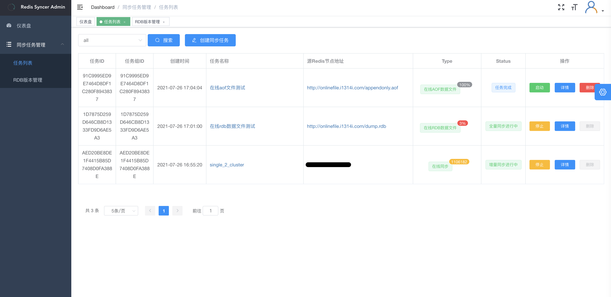

# RedisSyncer

[English](README_en.md)

RedisSyncer是一个redis多任务同步工具集，应用于redis单实例及集群同步。
该工具集包括：

* redis 同步服务引擎
  [redissyncer-server](https://github.com/TraceNature/redissyncer-server)
  
* redissycner 客户端
  [redissyncer-cli](https://github.com/TraceNature/redissyncer-cli)

* dashboard web控制面板  
  [redissycner-dashboard](https://github.com/TraceNature/dashboard_release)
  
* redis 数据校验工具
  [redissycner-compare](https://github.com/TraceNature/rediscompare)

* 基于docker-compse的一体化部署方案
  [redissyncer](https://github.com/TraceNature/redissyncer)

## 功能列表

* 单节点、多节点在线同步
* 指定db库数据映射
* 批量RDB文件并行导入
* 批量AOF文件并行导入
* 批量MIX混合文件导入
* 增量实时AOF文件生成
* 断点续传
* 大key自动拆分
* 指定key/command过滤或放行  
* rdb跨版本支持，支持高版本至低版本
* ttl校准
* 命令订阅(目标端支持kafka)

## Quick start

请参阅[Quick Start Guide](docs/quickstart.md),文档包括构建及部署方法及基本使用方法

## 使用说明文档
[使用说明](docs/using_documents.md)

## RoadMap

请参阅　[RoadMap](docs/roadmap.md)

## 编译环境

|     **环境条件** |   **版本号**  |
|      :----:     |     :----:   |
|  \[Maven\]     |  \[3.0+ \]   |
|  \[JDK\]       |  \[1.8 \]   |

## 运行环境

|     **环境条件**    |    **版本号**    |
|       :----:       |    :----:       |
|  \[JDK\]          |    \[1.8+ \]    |

## 支持Redis版本

|     **环境条件**     |**版本号**  |
| :----:| :----: |
|  \[Redis\]    |         \[2.8-6.2\]  |

## 支持的命令(写命令)
|   system   | String      | List         | Hash       |  Set        | ZSet     | Transactions |   GEO            |   Stream         | HyperLogLog      |
|------------|-------------|--------------|------------|-------------|----------|--------------|------------------|------------------|------------------|
| SElECT     | BITFIELD    | BLMOVE       | HDEL       | SADD        | BZPOPMAX |  EXEC        | GEOADD           | XSETID           | PFMERGE          |
| FLUSHALL   | APPEND      | BLPOP        | HINCRBY    | SDIFFSTORE  | BZPOPMIN |  MULTI       | GEOSEARCHSTORE   | XACK             | PFADD            |
| FLUSHDB    | BITOP       | BRPOP        | HMSET      | SINTERSTORE | ZADD     |  DISCARD     |                  | XADD             | PFCOUNT          |
| COPY       | DECRBY      | BRPOPLPUSH   | HSET       | SMOVE       |ZDIFFSTORE|              |                  | XAUTOCLAIM       |                  |
| PING       | DECR        | LINSERT      | HSETNX     | SPOP        | ZINCRBY  |              |                  | XCLAIM           |                  |
| DEL        | GETDEL      | LPOP         |HINCRBYFLOAT| SREM        | ZINTER   |              |                  | XDEL             |                  |
| EXPIREAT   | SETRANGE    | LPUSH        |            | SUNIONSTORE |ZINTERSTORE|             |                  | XGROUP           |                  |
| EXPIRE     | GETEX       | LPUSHX       |            |             | ZPOPMAX  |              |                  | XTRIM            |                  |
| SWAPDB     | GETSET      | LREM         |            |             | ZPOPMIN  |              |                  |                  |                  |
|            | INCR        | LSET         |            |             |ZRANGESTORE|             |                  |                  |                  |
|            | INCRBY      | LTRIM        |            |             |  ZREM    |              |                  |                  |                  |
|            | INCRBYFLOAT | RPOP         |            |             |ZREMRANGEBYLEX|          |                  |                  |                  |
|            | MSET        | RPOPLPUSH    |            |             |ZREMRANGEBYRANK|         |                  |                  |                  |
|            | MSETNX      | RPUSH        |            |             |ZREMRANGEBYSCORE|        |                  |                  |                  |
|            | PSETEX      | RPUSHX       |            |             |ZUNIONSTORE|             |                  |                  |                  |
|            | SETBIT      | SORT         |            |             |          |              |                  |                  |                  |
|            | SETEX       |              |            |             |          |              |                  |                  |                  |
|            | SETNX       |              |            |             |          |              |                  |                  |                  |
|            | SET         |              |            |             |          |              |                  |                  |                  |

## 支持数据类型

|     **源数据类型**          |       **说明**             |
| :----:| :----: |
|  \[Redis\]                |         \[存量数据同步\]    |
|  \[Redis\]                |         \[增量实时同步\]    |
|  \[Redis\]                |     \[存量+增量实时同步\]    |
|  \[Redis\]                |     \[生成实时增量AOF文件\]  |
|  \[本地RDB\]                |     \[本地RDB文件导入\]    |
|  \[在线RDB\]                |     \[文件url导入\]       |
|  \[本地AOF\]                |     \[本地AOF文件导入\]    |
|  \[在线AOF\]                |     \[文件url导入\]       |
|  \[本地混合文件\]            |     \[本地混合文件导入\]    |
|  \[在线混合文件\]            |     \[文件url导入\]        |

[comment]: <> "##支持命令"

[comment]: <> "|  命令  |  命令  | 命令    | 命令    |"

[comment]: <> "| :----:| :----: | :----: | :----: |"

[comment]: <> "| APPEND     | BLPOP      | SADD        |"

[comment]: <> "| SET        | BRPOP      | SCARD       |"

[comment]: <> "| SETEX      | BRPOPLPUSH | SDIFFSTORE  |"

[comment]: <> "| SETNX      |  LINSERT   | SINTERSTORE |"

[comment]: <> "| GETSET     |  LPOP      |   SMOVE     |"

[comment]: <> "| SETBIT     | LPUSH      |    SPOP     |"

[comment]: <> "| SETRANGE   | LPUSHX     |    SREM     |"

[comment]: <> "|  MSET     | LREM       | SUNIONSTORE |"

[comment]: <> "| MSETNX     | LSET       | 单元格 |"

[comment]: <> "| PSETEX     | LTRIM      | 单元格 |"

[comment]: <> "|  INCR     | RPOP       | 单元格 |"

[comment]: <> "| INCRBY     | RPOPLPUSH  | 单元格 |"

[comment]: <> "|INCRBYFLOAT | RPUSH      | 单元格 |"

[comment]: <> "|    DECR    | RPUSHX     | 单元格 |"

[comment]: <> "| DECRBY     | 单元格      | 单元格 |"

## [dashboard](https://github.com/TraceNature/dashboard_release)

## 致谢

### [Jedis](https://github.com/redis/jedis)

### [replicatior](https://github.com/leonchen83/redis-replicator) 

### [IntelliJ IDEA](https://www.jetbrains.com/?from=redissyncer-server)
