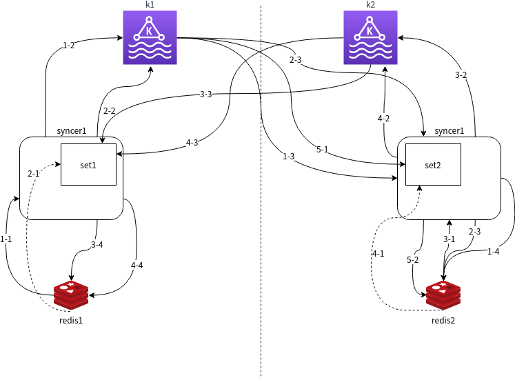

# 双向同步 Two-way synchronization
双向同步是指在两个实例都有存量数据和写流量的情况下进行两实例同步，最终达到两实例数据动态一致的过程。
双向同步的难点是。由于redis本身没有实例id,在双向同步时形成数据回环。破环的主要方式是利用数据缓冲进行冲销

Redis two-way synchronization is a process to make two redis instance when which provide services sync each other，and keep data  dynamic consistency.
the difficulty for this is ,redis is a system without instance id.when sync two instance data will form a sync ring and data will transfor between two instance Endless.
How to break the ring? We can use cache to write off the write back data. 

假设我们有两个redis实例redis1和redis2,再分别定义两个冲销池set1和set2。
For instance,we have 2 redis instance to sync each other and call them redis1 and redis2. define two write off cache set1 and set2.

1. 启动redis1->redis2的全量同步任务  Run redis1->redis2 full sync task 
2. 启动redis1->redis2增量任务 Run redis1->redis2 changed data sync task
    2-1. 增量任务先在set1做冲销(set1中存在的数据删除并丢弃同步) Write off the data from soure in set1(if the data in set1 delete it and drop the data, do not sent the data to target)
    2-2. 未被冲销数据同步到redis2 Sent the data which not be written off to target
3. 启动redis2->redis1的全量任务,此全量同步数据一定会作为增量形成回环，所以要先写入set1再写入redis1,以便数据作为增量回环同步到redis2时利用set1冲销
   Run redis2->redis1 full sync.The data from redis2 must be changed data transfor to redis1 by the step 2 task.So must write the data to set1 firest.When the data into redis1 produce changed data we write off it from set1.
    3-1. 写入set1 Write data to set1
    3-2. 写入redis1 Write data to redis1
4. 启动redis2->redis1增量任务，增量任务先在set2做冲销(set2中存在的数据删除并丢弃同步)，增量任务先写入set1在写入redis1避免循环复制
   Run redis2->redis1 changed data sync task.first ,the data write off in set2.Then write to set1 write to redis1
   4-1. 通过set2冲销数据 Write off data in set2
   4-2. 数据写入set1 Write to set1
   4-3. 数据写入redis1 Write to redis1
5. 改变redis1->redis2增量任务行为，增量任务先在set1做冲销(set1中存在的数据删除并丢弃同步)，未冲销数据先写入set2再同步到redis2
     Change step 2-2 behavior, Write data  into  set2 before write data to redis2
   5-1 写入set2 Write data to set2
   5-2 写入redis2 Write data to redis2

为什么增加第五步改变redis1->redis2增量任务行为呢？
Why change behavior step2?
因为在第四步完成时set2中并没有从redis1->redis2的增量数据，这会造成从redis1->redis2的增量数据会转换成redis2->redis1增量数据且在本地无法被冲销只有数据进入set1且被写入redis1后再次作为增量数据想redis2同步时才会被冲销，增加了网络开销同时redis1也增加了一次写入负载
Step 2-2 write data to redis2 directly,because at that time no task write off set2.After step 4,the data from redis1 will  back to redis1 and write off in set1. The behavior will increase network work load and redis1 work load .After change 2-2 step,data from redis2 will be written off locally

# 过kafka双向同步 Two-way synchronization with kafka
为保障数据在网络瞬断的情况下可以堆积，可以引入kafka或rocketmq等消息中间件。
每个数据中心分别部署消息中间件和redissyncer。本地redissyncer从该数据中心同步数据并作为生产者提供给本地消息中间件，远程redissyncer作为消费者将数据写入远程redis。
假设有两个数据中心分别部署redis1和redis2。redis1同中心部署kafka1(k1)和redissyncer1(syncer1),syncer1包含冲销缓存set1;redis2同中心部署kafka2(k2)和redissyncer2(syncer2),syncer2包含冲销缓存set2。
双向同步步骤如下：
1. syncer1上启动redis1->redis2的全量同步任务。syncer1写入k1,syner2消费数据写入redis2
   1-1 syncer1从redis1拉取全量数据
   1-2 数据写入k1
   1-3 syncer2从k1消费数据
   1-4 写入redis2
2. 启动redis1->redis2增量任务，syncer1上启动增量任务，首先在set1做冲销，然后写入k1，syncer2上消费k1数据写入redis2
   2-1 set1冲销
   2-2 写入k1
   2-3 syncer2消费数据到redis2
3. 启动redis2->redis1的全量任务,syncer2发起全量同步任务写入k2,syncer1消费数据，先写入set1再写入redis1
   3-1 syncer2发起全量任务拉取redis2全量数据
   3-2 数据写入k2
   3-3 syncer1消费来自k2的数据写入set1
   3-4 写入redis1
4. 启动redis2->redis1增量任务,syncer2发起增量任务，set2冲销后写入k2,syncer1消费数据，写入set1后，再写入redis1
   4-1 syncer2发起增量任务获取redis2增量数据, 数据在set2做冲销
   4-2 数据写入k2
   4-3 syncer1消费k2中的数据，写入set1
   4-4 写入redis1
5. 改变步骤2中syncer2的行为，先写入set2再写入redis2
   5-1 从k1来的增量数据写入set2
   5-2 写入redis2

