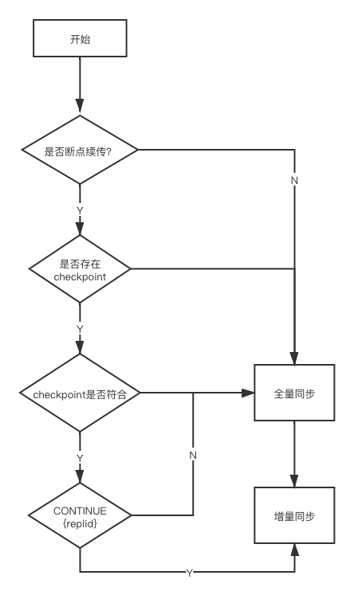
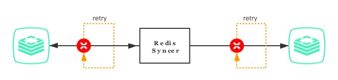
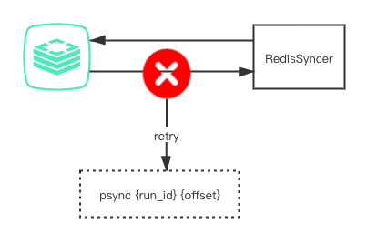
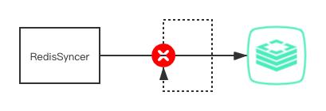
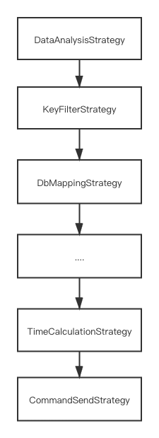
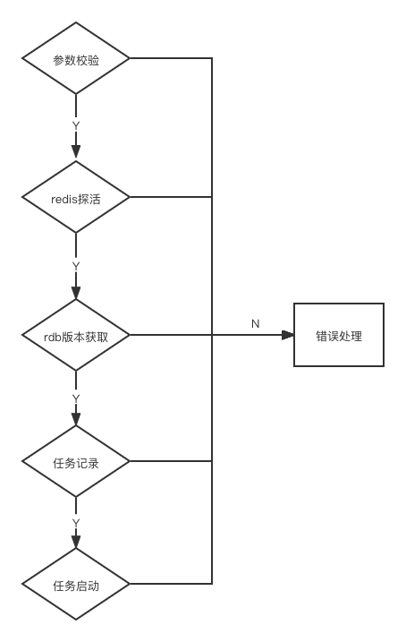

# RedisSyncer同步引擎的设计与实现

RedisSyncer一款通过replication协议模拟slave来获取源Redis节点数据并写入目标Redis从而实现数据同步的Redis同步工具

## 同步基本流程


                          ┌──────┐                          ┌──────┐                 ┌──────┐
                          │      │                          │      │                 │      │
                          │matser│                          │syncer│                 │matser│
                          │      │                          │      │                 │      │
                          └───┬──┘                          └───┬──┘                 └───┬──┘
                              │                                 │                        │
                              │    PSYNC {replid} {offset}      │                        │   
                              │ ◀────────────────────────────── │                        │   
                              │                                 │                        │   
                              │  FULLRESYNC {replid} {offset}   │                        │   
                              │ ──────────────────────────────▶ │                        │   
                              │                                 │                        │   
                              │          binary data            │     send commands      │   
                              │  ----------------------------▶  │ ─────────────────────▶ │   
                              │                                 │                        │   
                              │       CONTINUE {replid}         │                        │   
                              │ ──────────────────────────────▶ │                        │   
                              │                                 │                        │   
                              │        backlog commands         │                        │   
                              │  ---------------------------─▶  │                        │   
                              │                                 │                        │   
                              │                                 │                        │   
                              ┼                                 ┼                        ┼   

## 数据拉取流程

* 建立socket
* 发送auth user password (6.0新增user)

        OK 成功
        其他 error

* send->ping

         返回:
           ERR invalid password    密码错误
           NOAUTH Authentication required.没有发送密码
           operation not permitted 操作没权限
           PONG  密码成功
     
         作用：
            检测主从节点之间的网络是否可用。
            检查主从节点当前是否接受处理命令。

* 发送从节点端口信息

        REPLCONF listening-port <port>
    
            -->OK 成功
            -->其他  失败
* 发送从节点IP

        REPLCONF ip-address <IP>
    
             --> OK 成功
             --> 其他  失败

* 发送EOF能力（capability）

        REPLCONF capa eof

           --> OK 成功
           --> 失败
        作用:
           是否支持EOF风格的RDB传输，用于无盘复制，就是能够解析出RDB文件的EOF流格式。用于无盘复制的方式中。 
           redis4.0支持两种能力 EOF 和 PSYNC2
           redis4.0之前版本仅支持EOF能力

* 发送PSYNC2能力

         REPLCONF capa  PSYNC2
  
             --> OK 成功
             --> 失败
         作用: 
            告诉master支持PSYNC2命令 ,  master 会忽略它不支持的能力.  PSYNC2则表示支持Redis4.0最新的PSYN复制操作。

* 发送PSYNC

        PSYNC {replid} {offset}
  
          -->  FULLRESYNC  {replid}  {offset}   完整同步
          -->  CONTINUE 部分同步
          -->  -ERR 主服务器低于2.8,不支持psync,从服务器需要发送sync
          -->  NOMASTERLINK  重试
          -->  LOADING       重试
          -->  超过重试机制阈值宕掉任务

        读取PSYNC命令状态，判断是部分同步还是完整同步

全量完成后：

* PSYNC  ---> 启动heartbeat

        REPLCONF ACK <replication_offset>
        心跳检测
          在命令传播阶段，从服务器默认会以每秒一次的频率
          发送REPLCONF ACK命令对于主从服务器有三个作用：
        作用:
          检测主从服务器的网络连接状态；
          辅助实现min-slaves选项；
          检测命令丢失。
    
        REPLCONF  GETACK 
          ->REPLCONF ACK <replication_offset>

RedisSyncer内部有断点续传、数据补偿、断线重连等机制来保证数据同步过程中稳定性和可用性,具体的机制如下。

## 断点续传机制

RedisSyncer的断点续传机制是基于Redis的replid和offset来实现的，RedisSyncer有两个版本的断点续传机制v1和v2。

* v1版本:
  
        v1版本数据写入到目的端redis后，将offset持久化到本地，这样下次重启就从上次的offset拉取。但是由于该方案写目的端的操作和offset持久化不是一个原子的操作。如果中间发生中断会导致数据的不一致。
        例如，先写入数据到目的端成功，后持久化offset还没成功就发生了宕机、重启等情况，那么再次断点续传拉取上一次的offset数据最后就不一致了。
        

                      ┌─────────────────┐                                                                    ┌─────────────────┐
                      │                 │                          ┌─────────────────┐                       │                 │
                      │                 │ psync {replid} {offset}  │                 │                       │                 │
                      │                 │ ◀─────────────────────── │                 │       data            │                 │
                      │      Redis      │                          │   RedisSyncer   │─────────────────────▶ │      Redis      │
                      │                 │ ───────────────────────▶ │                 │                       │                 │
                      │                 │          data            │                 │                       │                 │
                      │                 │                          └─────────────────┘                       │                 │
                      └─────────────────┘                                   │                                └─────────────────┘
                                                                            │ write                                             
                                                                            │                                                    
                                                                            ▼                                                   
                                                                   ┌────────────────┐                                           
                                                                   │                │                                           
                                                                   │   checkpoint   │                                           
                                                                   │                │                                           
                                                                   └────────────────┘        

* v2版本:
  
        在v2版本策略中RedisSyncer会将每一个pipeline批次中不存在事务的的命令通过multi和exec进行包装,并在事务尾部插入offset检查点。
        当断点续传时需要从目标Redis的所以db库中查找checkpoint并找到所对应源节点当最大offset，再根据该offset进行断点续传。目前v2版本只支持目标为单机Redis的情况。
        在v2版本中
                      ┌─────────────┐                            ┌───────────────┐                     ┌─────────────┐
                      │             │  1.psync {replid} {offset} │               │                     │             │
                      │             │ ◀───────────────────────── │               │   4.checkpoint      │             │
                      │             │                            │               │ ──────────────────▶ │             │
                      │    Redis    │                            │  RedisSyncer  │     3.data          │    Redis    │
                      │             │ ─────────────────────────▶ │               │                     │             │
                      │             │    2.backlog commands      │               │                     │             │
                      └─────────────┘                            └───────────────┘                     └─────────────┘
* v2命令事务封装结构

         ┌───────────────────────────────────────────────────────────────┐
         │                                                               │
         │                             multi                             │
         │                              ...                              │
         │                           commands                            │
         │                              ...                              │
         │      hset redis-syncer-checkpoint {ip}:{port}-version...      │
         │                             exec                              │
         │                                                               │
         └───────────────────────────────────────────────────────────────┘

* v2 checkpoint检查点结构：
  
        HASH  hset redis-syncer-checkpoint {value}
        {value}:
            * {ip}:{port}-runid     {replid}
            * {ip}:{port}-offset    {offset}
            * pointcheckVersion     {version}

在Redis的事务机制中虽然不支持回滚，并且如果事务中间命令执行出错后但是事务还是被执行完成，但是除特殊情况外能够保证一致性。
在v2的机制中，为了防止'写放大'会在目标redis的每一个逻辑库中写入一个checkpoint，因此在执行断点续传操作的时候，同步工具会先扫描目标各个逻辑库中的checkpoint并选出里面最大offset的checkpoint作为断点续传的参数。
 

## 数据补偿机制

  数据补偿机制是RedisSyncer同步任务写入数据失败时的补偿机制。数据补偿的前提是命令写入的幂等性，因此在RedisSyncer中会先将INCR、INCRBY、INCRBYFLOAT、APPEND、DECR、DECRBY等部分非幂等命令转换成幂等命令后再写入目标端Redis。
  RedisSyncer在目标为单机Redis或者Proxy的时候是通过pipeline机制将数据写入到目标Redis中的，每一个批次的pipeline的提交会返回一个结果列表， 同步工具会验证pipeline中结果的正确性，如果部分命令写入失败，同步工具对该批次与该key相关的命令进行重试。
  如果重试超过指定的阀值,将会宕掉任务。对于存在大key的list等非幂等结构，将不会进行数据补偿，直接宕掉任务。

## 断线重连机制

  由于网络抖动等原因可能会导致同步工具源端与目标端连接在同步过程中断开,因此需要断线重试机制来保证在任务同步的过程中如果出现异常断开的问题。断线重连机制存在于与源Redis节点和RedisSyncer、RedisSyncer与目标Redis节点的连接之间，两者分别有各自的处理机制。
  

* 源Redis与RedisSyncer的断线重连机制是通过记录的offset来实现的，当因网络异常等原因断开了连接时，RedisSyncer会重新尝试与源Redis节点建立连接，并通过当前任务记录的runid、offset等信息去拉取断开之前的增量数据，连接重新建立成功后RedisSyncer的同步任务将会无感知继续同步。 当断线重连超过指定重试阀值或者因为offset刷过导致没有办法续传数据时，RedisSyncer会宕掉当前当同步任务，等待人工干预。

  

* RedisSyncer与目标Redis之间的断线重连机制是通过缓存上一批次的pipeline的命令来实现的，当连接断开异常时RedisSyncer进行重重连回放上一批次写入失败的命令。当回放失败或者超过连续重试次数RedisSyncer会宕掉当前当同步任务，等待人工干预。

  

## 命令的链式处理

RedisSyncer中采用链式策略处理同步数据，任何一个策略返回失败，该key都将不会被同步。链式策略流程如图所示

  

  每一个key在RedisSyncer都会经过一个策略链进行处理，只要有一个策略未通过则这个key将不会同步到目标Redis，比如key过期时间的计算策略如果计算出全量阶段key已过期，则将会自动抛弃该key。
  
  策略链中的策略包括

| 类型                    | 描述             |
| ----------------------- | ---------------- |
| DataAnalysisStrategy    | 命令统计分析策略 |
| KeyFilterStrategy       | 命令过滤策略     |
| DbMappingStrategy       | Db映射策略       |
| TimeCalculationStrategy | 过期时间计算策略 |
| RdbCommandSendStrategy  | 全量数据写入策略 |
| AofCommandSendStrategy  | 增量数据写入策略 |
| .....                   | .....            |

## 任务管理

* 任务启动流程

  
* 任务停止及清理流程
  
    任务主动停止时,RedisSyncer会先停止源Redis端的数据写入然后进入数据保护状态,确保可能还处在RedisSyncer中未写入目标的少部分数据能够完整的写入目标端，并且正确的记录写入的最后一条数据的offset并持久化，保证断点续传时RedisSyncer能够提供正确的offset。

* 任务状态

  | TYPE          | code | description       | status               |
  | ------------- | ---- | ----------------- | -------------------- |
  | STOP          | 0    | 任务停止          | 已使用               |
  | CREATING      | 1    | 创建中            | 已使用               |
  | CREATED       | 2    | 创建完成          | 已使用               |
  | RUN           | 3    | 运行状态          | 已使用               |
  | BROKEN        | 5    | 任务异常          | 已使用               |
  | RDBRUNING     | 6    | 全量RDB同步过程中 | 已使用               |
  | COMMANDRUNING | 7    | 增量同步中        | 已使用               |
  | FINISH        | 8    | 完成状态          | 已使用(用于文件导入) |

* 任务异常处理原则
  
    在RedisSycner任务中如果遇到可能会导致数据不一致的错误，RedisSyncer都会宕掉任务，等待人工干预。
  
### rdb跨版本同步实现

    rdb文件存在向前兼容问题，即高版本的rdb文件无法导入低rdb版本的Redis

* 跨版本迁移实现机制
    1. REDIS跨版本间存在的问题：
       由于REDIS是向下兼容(低版本无法兼容高版本RDB)，在其RDB文件协议中存在一个vesion版本号标识,REDIS在RDB导入或者全量同步执行<font color=red size=2>rdbLoad</font>时会先检测<font color=red size=2>RDB VERSION</font>是否符合向下兼容，如果不符合则会抛出 <font color=red size=2>Can’t handle RDB format version</font>   错误。
    1. syncer跨版本实现机制
       对于全量同步RDB数据部分syncer将其分命令为两类进行处理
       1. 对于可能存在大key的结构比如：SET,ZSET,LIST,HASH等结构:
          1. 对于对数据成员没有顺序性要求的命令如：SET,ZSET,HASH命令解析器将其解析成一个或多个sadd,zadd,hmset等命令进行处理
          2. 对于对数据成员有顺序性要求的命令如:List等命令，若被命令解析器判断为大key并将其拆分为多个子命令，此时必须保证按顺序发送至目标REDIS节点
       2. 对于其他命令如：String等结构：
          为保证其命令幂等性，命令解析器会根据目标REDIS节点的RDB版本进行序列化(实现<font color=red size=2>DUMP</font>)，传输模块会使用<font color=red size=2>REPLACE</font>反序列化到目标节点。（其中在redis3.0以下版本<font color=red size=2>REPLACE</font>命令不支持[<font color=red size=2>REPLACE</font>]）

RDB文件协议中关于 RDB VERSION部分

```
REDIS RDB文件结构开头部分示例
 ----------------------------# RDB is a binary format. There are no new lines or spaces in the file.
 52 45 44 49 53              # Magic String "REDIS"
 30 30 30 37                 # 4 digit ASCCII RDB Version Number. In this case, version = "0007" = 7   RDB VERSION字段
 ----------------------------
 FE 00                       # FE = code that indicates database selector. db number = 00
```

关于 RDB VERSION检查部分伪代码

```
def rdbLoad(filename):
    rio =  rioInitWithFile(filename);
    # 设置标记：
    # a. 服务器状态：rdb_loading = 1
    # b. 载入时间：loading_start_time = now_time
    # c. 载入大小：loading_total_bytes = filename.size
    startLoading(rio)
    # 1.检查该文件是否为RDB文件（即文件开头前5个字符是否为"REDIS"）
    if !checkRDBHeader(rio):
        redislog("error, Wrong signature trying to load DB from file") 
        return
    # 2.检查当前RDB文件版本是否兼容（向下兼容）
    if !checkRDBVersion(rio): 
        redislog("error, Can't handle RDB format version")
        return
 .........
    //Redis中关于RDB_VERSION检查的代码
    rdbver = atoi(buf+5);
    if (rdbver < 1 || rdbver > RDB_VERSION) {
        rdbCheckError("Can't handle RDB format version %d",rdbver);
        goto err;
    }
```

### RDB 同步过程中的大 Key 拆分

### 附录一  Redis RDB协议

[redis RDB Dump 文件格式](https://github.com/sripathikrishnan/redis-rdb-tools/wiki/Redis-RDB-Dump-File-Format)

    ----------------------------# RDB is a binary format. There are no new lines or spaces in the file.
    52 45 44 49 53              # Magic String "REDIS"
    30 30 30 37                 # 4 digit ASCCII RDB Version Number. In this case, version = "0007" = 7
    ----------------------------
    FE 00                       # FE = code that indicates database selector. db number = 00
    ----------------------------# Key-Value pair starts
    FD $unsigned int            # FD indicates "expiry time in seconds". After that, expiry time is read as a 4 byte unsigned int
    $value-type                 # 1 byte flag indicating the type of value - set, map, sorted set etc.
    $string-encoded-key         # The key, encoded as a redis string
    $encoded-value              # The value. Encoding depends on $value-type
    ----------------------------
    FC $unsigned long           # FC indicates "expiry time in ms". After that, expiry time is read as a 8 byte unsigned long
    $value-type                 # 1 byte flag indicating the type of value - set, map, sorted set etc.
    $string-encoded-key         # The key, encoded as a redis string
    $encoded-value              # The value. Encoding depends on $value-type
    ----------------------------
    $value-type                 # This key value pair doesn't have an expiry. $value_type guaranteed != to FD, FC, FE and FF
    $string-encoded-key
    $encoded-value
    ----------------------------
    FE $length-encoding         # Previous db ends, next db starts. Database number read using length encoding.
    ----------------------------
    ...                         # Key value pairs for this database, additonal database
    
    FF                          ## End of RDB file indicator
    8 byte checksum             ## CRC 64 checksum of the entire file.

    RDB文件以魔术字符串“REDIS”开头。
    52 45 44 49 53 # "REDIS"

    RDB 版本号
    接下来的 4 个字节存储 rdb 格式的版本号。这 4 个字节被解释为 ascii 字符，然后使用字符串到整数转换转换为整数。
    00 00 00 03 # Version = 3

    Database Selector
    一个Redis实例可以有多个数据库。
    单个字节0xFE标记数据库选择器的开始。在该字节之后，一个可变长度字段指示数据库编号。请参阅“长度编码”部分以了解如何读取此数据库编号。

    键值对
    在数据库选择器之后，该文件包含一系列键值对。
    
    每个键值对有 4 个部分 -
    
    1.密钥到期时间戳。
    2.指示值类型的一字节标志
    3.密钥，编码为 Redis 字符串。请参阅“Redis 字符串编码”
    4.根据值类型编码的值。参见“Redis 值编码”

### 附录二 Redis RESP协议

[Redis RESP协议](https://redis.io/topics/protocol#resp-simple-strings)

RESP 协议是在 Redis 1.2 中引入的，但它成为了 Redis 2.0 中与 Redis 服务器通信的标准方式。是在Redis 客户端中实现的协议。
RESP 实际上是一种序列化协议，它支持以下数据类型：简单字符串、错误、整数、批量字符串和数组。

RESP 在 Redis 中用作请求-响应协议的方式如下：

* 客户端将命令作为批量字符串的 RESP 数组发送到 Redis 服务器。
* 服务器根据命令实现以其中一种 RESP 类型进行回复。

在 RESP 中，某些数据的类型取决于第一个字节：

* 对于简单字符串，回复的第一个字节是“+”
* 对于错误，回复的第一个字节是“-”
* 对于整数，回复的第一个字节是“：”
* 对于批量字符串，回复的第一个字节是“$”
* 对于数组，回复的第一个字节是“ *”
  
RESP 能够使用稍后指定的批量字符串或数组的特殊变体来表示 Null 值。在 RESP 中，协议的不同部分总是以“\r\n”（CRLF）终止。

#### RESP Simple Strings

'+' 字符开头，后跟不能包含 CR 或 LF 字符（不允许换行）的字符串，以 CRLF 结尾（即“\r\n”）。如:

```
"+OK\r\n"
```

#### RESP Errors

```
 "-Error message\r\n"  
```

如:

```
-ERR unknown command 'foobar'
-WRONGTYPE Operation against a key holding the wrong kind of value 
```

#### RESP Integers

Integers只是一个 CRLF 终止的字符串，代表一个整数，以“:”字节为前缀。
例如

```
":0\r\n" 
":1000\r\n"
```

#### Bulk Strings

用于表示长度最大为 512 MB 的单个二进制安全字符串。批量字符串按以下方式编码：

* “$”字节后跟组成字符串的字节数（前缀长度），以 CRLF 结尾。
* 实际的字符串数据。
* 最后的 CRLF。

“foobar”的编码如下：

```
"$6\r\nfoobar\r\n"
```

当字符串为空

```
"$0\r\n\r\n"
```

Bulk Strings还可以用于表示 Null 值的特殊格式来表示值不存在。在这种特殊格式中，长度为 -1，并且没有数据，因此 Null 表示为：

```
"$-1\r\n"
```

#### RESP Arrays

格式：

* 一个'*'字符作为第一个字节，然后是数组中元素的数量作为十进制数，然后是 CRLF。
* Array 的每个元素的附加 RESP 类型。
空数组表示为：

```
"*0\r\n"
```

“foo”和“bar”的数组表示为

```
"*2\r\n$3\r\nfoo\r\n$3\r\nbar\r\n"
```

["foo",nil,"bar"] （Null elements in Arrays）

```
*3\r\n$3\r\nfoo\r\n$-1\r\n$3\r\nbar\r\n
```
